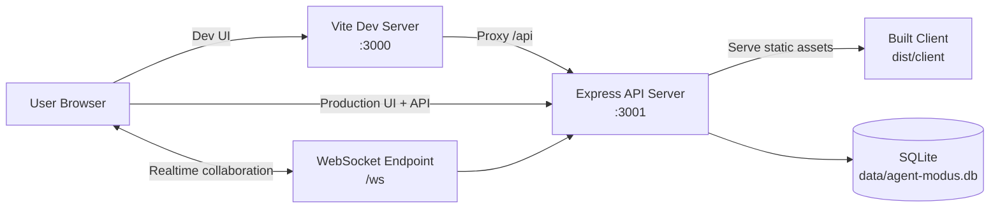

# Agent Modus Map

Agent swarm planning and design platform with a React client and an Express API.

## Major Components

- Web Client (React + Vite)
	- Location: `src/client`
	- Purpose: Main user interface for building, visualizing, testing, and exporting swarms.
	- Dev behavior: Served by the Vite dev server on port 3000.
	- Prod behavior: Built static assets in `dist/client`, served by the API server.

- API Server (Express)
	- Location: `src/api/server.ts`
	- Purpose: REST API for swarm CRUD, templates, simulation, docs, auth, settings, governance, and other backend features.
	- Runtime port: 3001 by default (`PORT` env var supported).
	- Additional role in production: Serves the built frontend and handles SPA fallback routing.

- Database Layer (SQLite via better-sqlite3)
	- Location: `src/api/db`
	- Purpose: Persists swarms, agents, relationships, operational records, and other backend state.
	- Storage: `data/agent-modus.db`.
	- Startup behavior: Database schema is initialized automatically when the API boots.

- Real-time Collaboration Server (WebSocket)
	- Location: `src/api/services/websocket-service.ts`
	- Purpose: Handles live collaboration updates and cursor/session synchronization.
	- Endpoint: Attached to the same HTTP server at `/ws`.

- Shared Types and Contracts
	- Location: `src/shared`
	- Purpose: Shared type definitions and design tokens used by both client and API to keep contracts consistent.

- Build Artifacts
	- Client output: `dist/client`
	- API output: `dist/api`
	- Purpose: Production-ready compiled assets used by `pnpm start`.

## System Diagram



## Run With pnpm (recommended)

```bash
corepack enable
pnpm install
pnpm dev
```

## Development

```bash
pnpm dev
```

This starts:
- Client: http://localhost:3000
- API: http://localhost:3001

## Production

```bash
pnpm build
pnpm start
```

`pnpm start` runs the API in production mode and serves the built client from `dist/client`.
